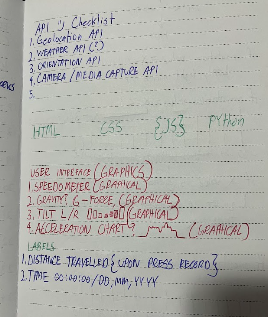
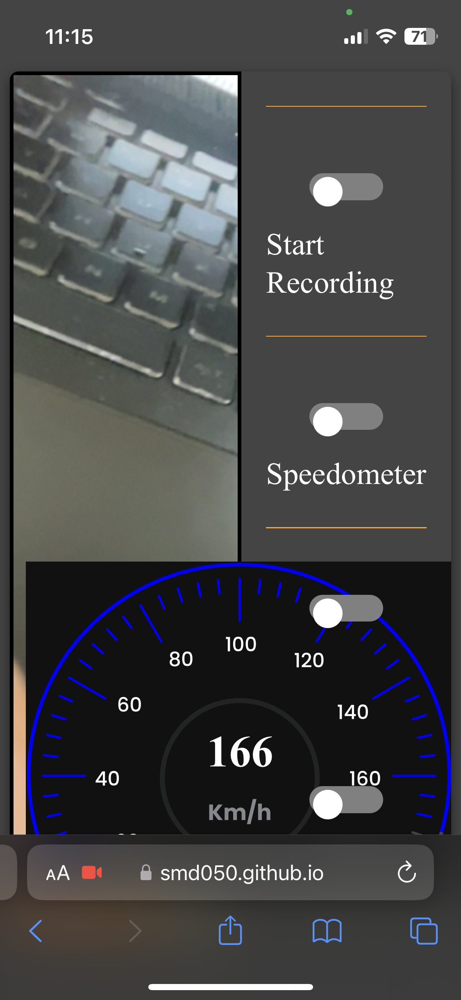
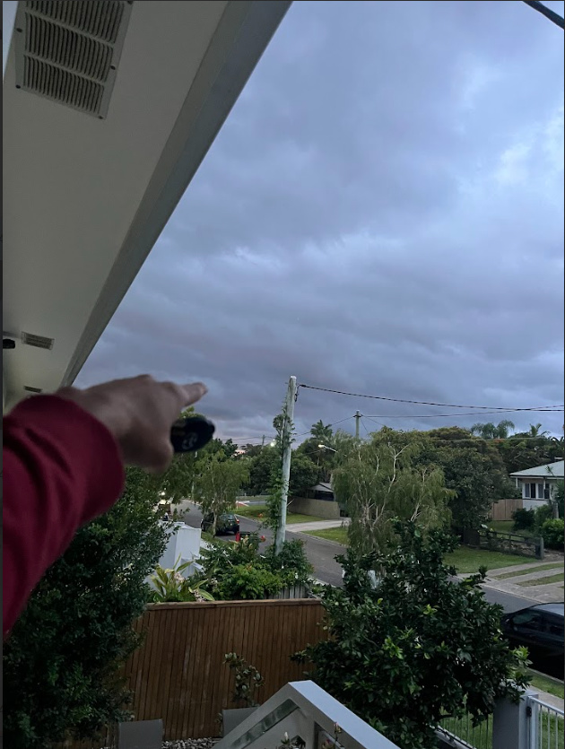

# DES222 Task 2 Process Journal 
### Sean De Guzman - 1171469

# Introduction
This design process journal aims to record my decision making and thought process throughout the creation of an interactive website or at least a context aware innovation. 

# Initial Ideas
The first two ideas that came to mind were an interactive drawing app then a recreational activity tracker app. 

The web app uses geological coordinates and a user input, (either from the a mobile phone itself or an external hardware such as the microbit) to draw digital lines around the sorrounding environment.

Second to that is  a web app that is context aware of the user's geological location. On top of that the web app can track the user's speed and tilt or lean angle as this app is heavily influenced for motorcycle riders who want to keep track of their activities.

# Research
From here on, the vr drawing app will be referred to as "option 1, design 1, or digital drawing app" and the recreational activity tracker app will be referred to as "option 2, design 2, or GeoTrack onwards.

After some research about VR videos for option one, there came the trouble of finding a way to make the one screen video into two split screen video that is fitting for the VR headset to be used.

Further research later, i find the whole idea of splitscreens in vr headsets confusing and a bit too much. Moreover the resources required including a data storage for drawings or probably lenses and 3d printing materials is far beyond my reach so I have given up on it for now.

For the design 2, it was fairly easy to find APIs after searching 'camera access' and hit either the first result or scroll a few bits to avoid unnecessary paid content.

Should the camera capture be able to adjust itself with the settings a action camera or dslr camera have? Hard no, I am not doing that as long as the main functions would work as fine, luxiries does not matter at this point for now.

# Inspirations
Even before the idea of GeoView Web App, some similar stuff were already made for other specific products. There was this one third-party web app that can tap into a GoPro 11 camera and access its geolocation and add speedometer overlay while it records.

Found it, its some sort of telemetry thing: 

https://goprotelemetryextractor.com/gopro-gps-not-working-hero8-quik 

https://www.youtube.com/watch?v=6WtzRh4JGw4 by: Ed Ricker (Youtube)

It did not took me long to figure out Google also have the bubble thing to measure device orientation by googling 'bubble level' and it shows at the very top of the results.

It was noon on a Thursday, I forgot Toby went to Japan and there were no workshop this week, I had to wait for 2 hours wandering and enjoying air for the time being after my 8am - 10am class. Along the way, I wondered if features such as the wind would be a major factor or and important detail to be displayed for the design 2.

After arriving home the same day, Toby uploaded two pre-recorded episodes of 'Device Orientation API' and 'Media Capture API' and it was perfect. I have all the infinity stones to create something abominable. Weekly modules are time locked for students to view as well, I think.

# The Development Group
I paired up with Jay and Torin, with them approaching me and having a near similar interest to the project concept. Jay, has an interest working with back-end development. While just chatting after class, he is keen to further develop his skills and understanding of programming and software development. 

Torin on the contrary, likes front-end development and design. He is generally broader and intuitive with the ideas he adds on top of the project which adds possible features and technicality along the way.

I personally don't mind either tasks as I have experience with them but not so often in groups. I see this as an opportunity to me to discover working with random people more and how to keep our ideals aligned or at least for the project to not incline to an overly unrealistic thing before the deadline.

# Setbacks
I generally plan things a week or two ahead and set a personal due date however, circumstances does not favor me at the moment by consistently being preoccupied by work, moving stuff and other assessments that are due sooner. 

We paired up as a groupd back in week 7, it was Me and Torin at first, then Jay came along during week 9 which was better than being short handed. Communication was also dire at the very start, they were also preoccupied by other courses which is a hundred per cent understandable and everyone got personal lives, especially when week break hit.

Personally I am not fond with using python which was Jay's forte in programming langguage as i keep adding curly brackets or semicolons to the functions being a C# and java programming langguage habit.

Conflict of iterests also arises but not that severe, the idea started for motorcycles and it went into boats? However in a sense, the project also expanded covering mountainbiking, tool to avoid getting lost (Internet access required), and level bubble measuring tool which makes it flexible.

# Reflection (Week 10 From hereon out)
Immediately, I find this way of journaling or documenting amusing than traditional notebook and pens, it lets me add images and freely edit things on how I see fit. Truly revolutionary for my digital literacy. 

I tend to work alone and fixate on one thing at a time like the artefact itself, but process entry for breaks is refreshing and I can backtrack where and why things are going now, and will be aiming towards the future.

Working in groups had its ups and downs in my honest opinion, but it outweighs the negatives by having multiple people work on the same thing. In a way, it eases the workload while in return, everyone benefits from different perspectives and approaches to setbacks.

# Pre-Development
I added this because may be Jay and Torin's introduction to Model View Controller (MVC) web api project. This section will be mostly for the group's vision for the project design to align and tie down things altogether.

## Mock Design
Torin took heavy inspiration from the sketch we made weeks prior, we now have a blueprint or layout which will be done in an interactive HTML web page.

## Pseudocode
Me and Jay made pseudocode while Torin was making the mock design and some powerpoint presentation for next week. 

# Presentation and Feedback Reflection
After the presentation on Week 10, it was as expected that Torin and Jay's  ideas would get the overall scope of the project get mixed up with broadly new ideas. Ideally it was only supposedly functional for Motorcycle/Bicycle or similar as a recreational tool to record and monitor activity data. The project then became broader by adding Wind speed, extra functions to measure land or those tools tradies use to measure land level. 

# Mock Scenario
From my experience on web developing, it is crucial to have a specified set of objectives and narrow each steps down to make things clear regarding what needs to be done and how should the sequence done accordingly.

		
# Laptop Crash Incident
2024/11/14 - Roughly around 1 am, I finished my web app's final UI adjustments and minor optimisations for the back end code processes. I took around a 45 minute break for dinner and when I came back, the laptop suddenly isn't working. 

### Denial
 

### Anger

### Bargaining
I had to declutter stuff to find old laptops. Laptop 1 missing battery, Laptop 2 missing power supply, Laptop 3 also broken. 
Still not convinced of the events, tried to find a different power plug around the house to fix the issue but to no avail. 
As my last course of action, I drove to Uni in the middle of the night, tried the outlets near the library at ground floor but unfortunately, it didn't work either.

### Depression
To think that this event would befall me is so random and unfortunate, I just had a moment in time after buying an apple juice at Cafeteria C's vending machine and enjoy the light gusts of wind mixed with rains last night.

### Acceptance
Reflection: It's sureal and I assume if I request an extension, it would fall under the subject of heavy investigation like "My dog ate my digital homework." kinda scenario even though we got no pets lol. I just concluded to come up with a solution after a quick nap, email course coordinators later on, pay a visit back to the library where staff will be more available than early morning.

Everything from hereon will be written by memory. Missing images (specifically screenshots) will be described by text as thorougly as possible.

# Implementation
After some meetings, the group decided to make their personal inpterpretation of the project by building their own design and such. Basing of from my sketches and Torin's mock design, we continue on. To distinguish my work, i planned to add widgets to the interface such as Speedometer, Lean Angle Meter, Drag Meter (direction of gravity pull), and any other additional details on undefined section of an overlay.

At first the app supposedly needs around 7 APIs namely, camera, media capture, orientation, speed, location, wind, gravity, and etc. 
As the project commences development and take form, things got narrowed down such as the speed API also uses the geo location to calculate distance travelled.
 

We added switch toggles, when state is on or true, either shows corresponding dial or function. The Recording switch highlights the video area capture red. Red for the colour as it is distinguishable for both daylight and nightlight environmental scenarios.

This is the initial contents planned for the overlay display.

Initially, we are set to have the main container to contain both video and toggles, followed by the video container in place so that the overlay container can inherit the size and overlay the graphics on top of it. Followed by the canvas where media capture recording takes place.

We have the main-container, video-container, canvas, and the overlay-content in html planned to get things on top of each other and properly video capture.

The lean angle math crisis was an intensive mental and imaginative thinking of how should the result should be.

Some more graphical imagination of the widget and corresponding math data.

Figuring out the math on which axis represents the landscape, lean left or right variables.

However, all of this was scrapped after it was tested that on Jay's laptop, it would only need the Y axis, it starts off from 0.00 degree and turns negative to the left and positive to the right in terms of values.
This is then tranferred to an event handler to change the widgets and match current events at 100 milisecond event updates. 

# Integrity & Unit Testing 
Module testing was done to implement the overlay (from a different project folder) into the main project. 

Once the overlay was done, copy pasted the contents and match accordingly to fit the main project requirments.
(lost Media)

Canvas is then added as the target for the media api to record dynamic web elements.

When web app tested on another device, (mobile phone, lower screen size and resolution), web elements merges or mis-aligns. 

I tried all i could for the lean meter, it only works for Jay's laptop for some unknown reason. It just displays 0.00 values on different devices or none at all, not even an exception, null value or error. 6 gruesome hours later, it has been figured out that it only works on Android Devices. It was perfectly fine.

Left

Middle

Right

# Adjustments
This is where i throw away(allegedly) what i learnt from week 9 about interactive websites. To solve the problem of the web page not properly loading when viewed on a smaller resolution device i.e. container elements merging, overshooting, or mis-aligning. 

The user then can manually zoom in or out on the web page without compromising UI elements.

# Handover & Checklist
### Ratings are added to identify priority levels to which areas needs improvement or just possible optimisation. 1 being the lowest and 5 being the highest.

 ### Functionalities:
### ✔ Recording - 3, Media and Audio are captured.  

### ✔ Speed - 4 Works well, except a significant change in location is needed for it to functionally work, random numbers are added in interval to provide mock display to capture UI correspondence from data to widget. Otherwise display N/A or null. 

### ✔ Media Capture - 3, using canvas html elements, we can capture the overlays however, research and development still lacks as it can only capture text displays over graphical widgets. Otherwise the usage of the devices' personal screen recorder is much suitable and crop the media itself to capture the entire thing freely. 

### ✔ Lean Angle Meter - 3, Works exeptionally well (ONLY WORKS FOR NON IOS DEVICES) while portraying data given by the Y axis data.

### ? Telemetry Data - 3, functional but tentative, probable cause of incosistency may be from variety of devices tested. Otherwise a general reformation of the code to fit whatever device is used may be considered (e.g. on Torin's laptop, everything works except speedometer, everything works on the phone except XYZ data, on Jay's device, Z data is missing but the lean angle meter only works for his laptop).

### User Interface:
### ✔ Containers - 5, fixed and user device friendly, having the will to freely adjust the zoom without compromising web elements.
### ✔ Overlays - 5, consistent overlay on top of the video-container.
### ✔ Canvas - 3, works but needs further developments, especially where graphical elements cant be drawn() but text elements can be added.
### ✔ Switches 5, toggleable, fun to mess around. Works as intended.
### ✔ Lean Angle Meter - 5, corresponds well with current lean either left or right and perfectly indicates it.
### ✔ Speedometer - 5, Works well and analysed from codepen to match web app: https://codepen.io/yudizsolutions/pen/LYaVmjx

# Conclusion & Findings
Working with codepen widgets are confusing as it is not my code and it takes a long time for me to decipher how it is done. Moreover, the canvas does not like these widgets so I may use png images instead with transparent backgrounds to match with speed text.

Always cross test between multiple platforms as results may highly vary from one another. Api are third-party tools or library that can have multiple functions underneath.

Although the app is not fully functional, it is a prototype for future developments and improvments are already considered, this project will be version 1.0 upon submission and be continued development as a hobby project. Optimisation and more careful development will be done given the vast amount of timeframe for research and development.

# Final Project Realisation
I was lucky enough that bits and pieces of my web app was saved on github as a random "checkpoint", which is the term i used to commit changes and have the web app uploaded to the internet for my phone to access and preliminarily tests if the web app is working.

The use of AI are kept minimum, toggle switches and the slider bar are from my DES221 web app for the microbit. However for javascript functions and such, ChatGPT is used to narrow down the abundance of information on the internet and generate examples for me to replicate matching my code logic needs and set rules and parameters.

Overall, it is interesting to work on these kind of projects being a full stack developer. I could consider this as modern day inventors' craftsmanship.

Drove all the way to Chermside despite heavy rain and light hail along the freeway to borrow a laptop and rework the process journal from memory. Evrything was a rollercoaster ride and I absolutely had fun during the entire process.
 
# Sean De Guzman
### 1171469
## (:

